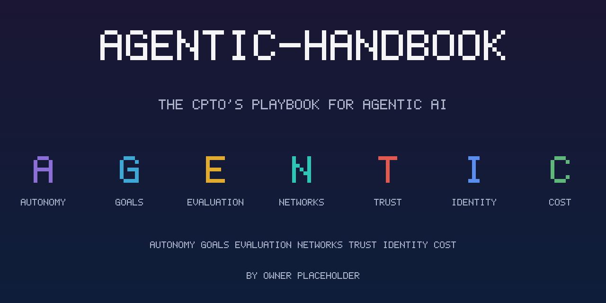

# agentic-handbook

> The CPTO's playbook for agentic AI: patterns, anti-patterns, decision trees, and procurement-grade
> checklists for shipping reliable agents in production. Vendor-neutral, with explicit EU AI Act framing.

**Production agents fail because the system around the model is weak.** A capable model is necessary and
nowhere near sufficient: what breaks in production is the autonomy you granted, the evals you skipped,
the tool you left ungated, the bill you didn't cap. The seven surfaces of a reliable agent system spell
**AGENTIC**.

**[Learn the patterns →](docs/03-pattern-catalog.md)**  ·
**[Grab a template →](templates/README.md)**  ·
**[See one run →](examples/README.md)**

## The seven surfaces — AGENTIC

| | Surface | What it covers |
|---|---------|----------------|
| **A** | Autonomy | How much the agent decides for itself, and where the workflow rails are. |
| **G** | Goals | Design specs and structured outputs that pin down what the agent is for. |
| **E** | Evaluation | The eval-driven loop and the observability that proves the agent works. |
| **N** | Networks | The protocol stack that connects agents to tools and to each other (Skills/MCP/A2A). |
| **T** | Trust | Security, the threat model, the EU AI Act, and the anti-patterns that get you breached. |
| **I** | Identity | Who the agent is, what it is allowed to do, and how it authenticates. |
| **C** | Cost | The cost stack and model selection that keep the bill survivable. |

The mnemonic, surface by surface, is [chapter 01](docs/01-mnemonic-and-systems-map.md); the full
chapter map is canonical in [`repo.config.json`](repo.config.json).

## Capability tiers ↔ EU AI Act

Classify every agent on a five-rung autonomy ladder, and read the EU AI Act risk class it floors at.
This mapping is canonical and identical everywhere it appears in the repo.

| Tier | Name | Criteria | EU AI Act risk class |
|------|------|----------|----------------------|
| L0 | Suggest-only | Drafts and suggestions; a human takes every consequential action. | minimal |
| L1 | Act-with-approval | Agent proposes actions; a human approves each before execution. | limited |
| L2 | Act-with-guardrails | Agent acts inside hard, pre-execution policy limits; humans review after the fact. | limited |
| L3 | Act-autonomously | Agent acts unattended within a bounded domain; HITL only on flagged exceptions. | high-risk |
| L4 | Self-directed | Agent sets and revises its own goals across domains without scoped human oversight. | prohibited |

The risk class is the floor, not the ceiling — a sensitive domain raises it. See
[chapter 12](docs/12-eu-ai-act-as-architecture.md) and the
[capability-tier ladder](templates/capability-tier-ladder.md).

## Start with the decision tree

The most valuable decision is usually **not building an agent**. Begin at the
**[decision framework →](docs/02-decision-framework.md)**: when a plain function beats an LLM, when a
workflow beats an agent, and when multi-agent earns its keep.

## What's inside

- **[The guide](docs/README.md)** — 19 chapters, AGENTIC end to end.
- **[Templates](templates/README.md)** — 16 copy-paste, procurement-grade artifacts.
- **[Diagrams](assets/diagrams/README.md)** — 15 Mermaid diagrams, sources included.
- **[Examples](examples/README.md)** — five runnable mini-codebases that execute against a mock
  provider, with the trace and eval receipts committed — see one actually run.
- **[Presentations](presentations/)** — three board-ready one-pagers (PDF).

New here? The [FAQ](FAQ.md) answers the usual questions (no, you don't need an API key to run the
examples).

## What this is not

Not a framework — it takes no dependency you must adopt, and it argues most "agents" should be
workflows. Not a tutorial series — it teaches decisions, not keystrokes. Not a link list — every
external claim sits in [`references.md`](references.md), and volatile figures carry an
_as of June 2026 — verify before relying_ label.

## License

MIT — see [LICENSE](LICENSE). Contributions welcome; see [CONTRIBUTING.md](CONTRIBUTING.md).
