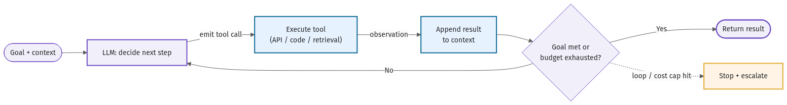
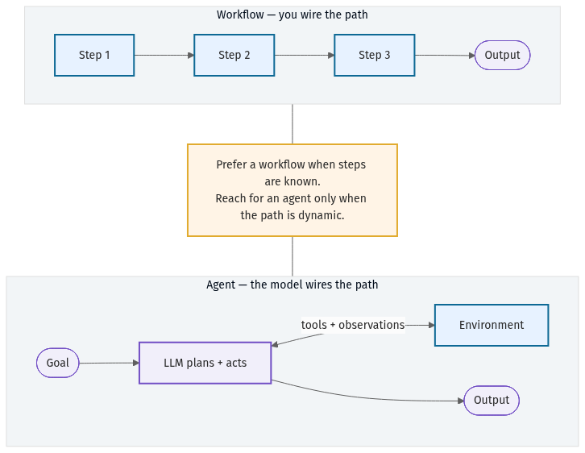
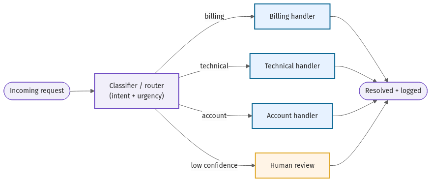
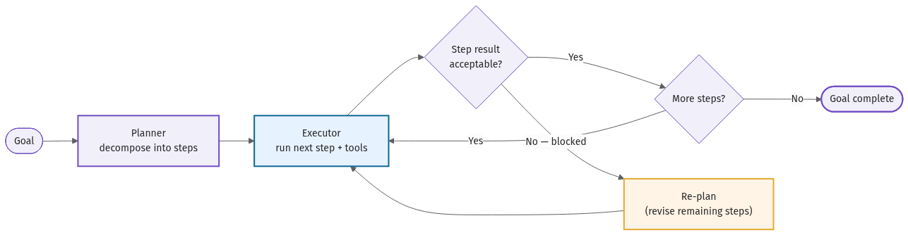
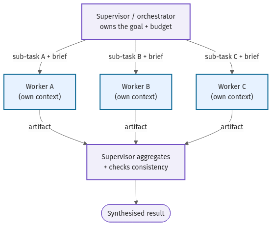
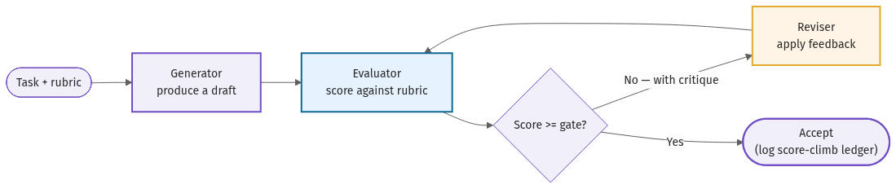
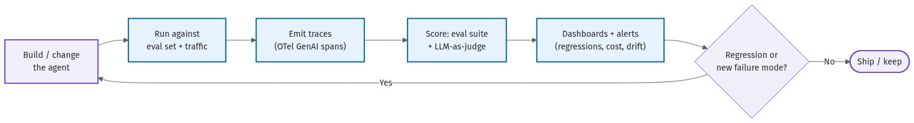
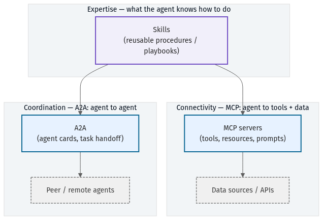
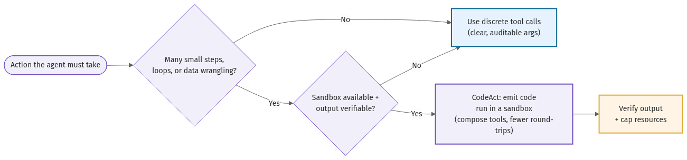

# Diagram gallery

All 15 diagrams in the handbook. Sources live in [`src/`](src/) as Mermaid (`.mmd`) and render to
PNG via the `/mermaid-render` skill. Until a diagram is rendered it shows a labeled placeholder, so
the render-check stays green throughout the build.

| # | Diagram |
|---|---------|
| 00 |  |
| 01 |  |
| 02 |  |
| 03 |  |
| 04 |  |
| 05 |  |
| 06 |  |
| 07 |  |
| 08 |  |
| 09 |  |
| 10 |  |
| 11 |  |
| 12 |  |
| 13 |  |
| 14 |  |
