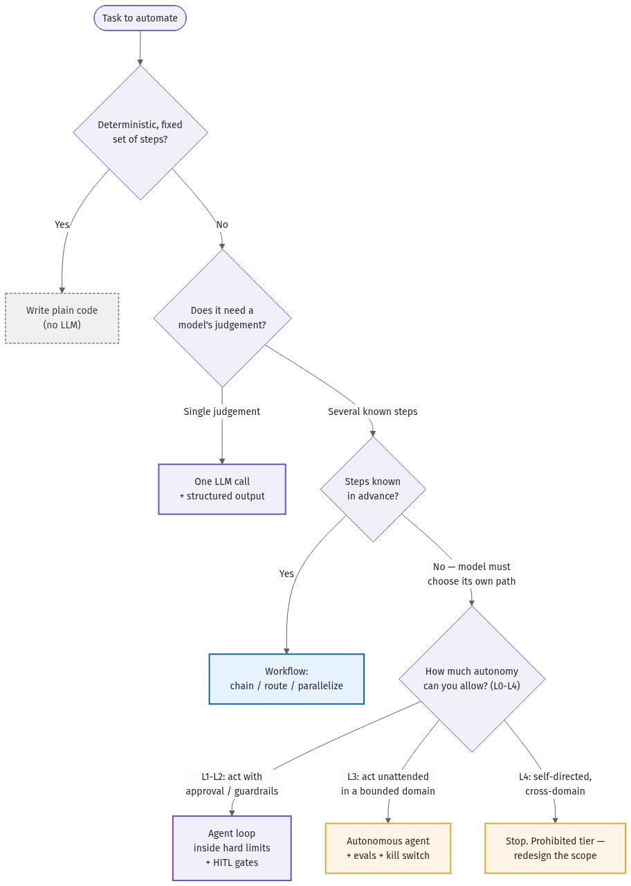

# 01 · Mnemonic & systems map

The seven surfaces of a reliable agent system spell **AGENTIC**. This chapter walks each surface and
then draws the systems map: the ladder from a single LLM call up to a multi-agent system, and where
the boundaries are.

## AGENTIC, surface by surface

| Letter | Surface | What it covers | Maps to chapters |
|--------|---------|----------------|------------------|
| **A** | Autonomy | How much the agent decides for itself, and where the workflow rails are. | [02-decision-framework](02-decision-framework.md), [03-pattern-catalog](03-pattern-catalog.md) |
| **G** | Goals | Design specs and structured outputs that pin down what the agent is for. | [00-introduction](00-introduction.md), [03-pattern-catalog](03-pattern-catalog.md) |
| **E** | Evaluation | The eval-driven loop and the observability that proves it works. | [13-evaluations](13-evaluations.md), [14-observability-lite](14-observability-lite.md) |
| **N** | Networks | The protocol stack connecting agents to tools and to each other. | [06-protocol-stack-skills-mcp-a2a](06-protocol-stack-skills-mcp-a2a.md) |
| **T** | Trust | Security, the threat model, the EU AI Act, and the anti-patterns. | [11-security-and-threat-model](11-security-and-threat-model.md), [12-eu-ai-act-as-architecture](12-eu-ai-act-as-architecture.md), [17-anti-patterns](17-anti-patterns.md) |
| **I** | Identity | Who the agent is, what it may do, and how it authenticates. | [10-agent-identity-and-auth](10-agent-identity-and-auth.md) |
| **C** | Cost | The cost stack and model selection that keep the bill survivable. | [15-cost-stack](15-cost-stack.md), [09-model-selection-for-roles](09-model-selection-for-roles.md) |

The seven are not a checklist you finish; they are surfaces you keep tending. A weak surface anywhere
is where production breaks: a strong model with no **E**valuation ships regressions silently; a clever
agent with no **T**rust surface exfiltrates data on the first poisoned web page. Under **T**rust, the
**EU AI Act** is treated as architecture, not paperwork — the capability tier you operate at carries a
risk class you must design for ([chapter 12](12-eu-ai-act-as-architecture.md)).

## The systems map: five rungs of "agentic"

Most things called "agents" are further down this ladder than the marketing suggests. Climb only as
far as the task forces you to.

1. **A single LLM call.** One prompt, one response, optionally with structured output. No tools, no
   loop. Most "AI features" are this. It is the cheapest, most reliable rung — start here.
2. **An LLM application (chained calls).** Several LLM calls wired by *your* code: classify, then
   route, then summarize. The control flow is fixed and inspectable. This is a **workflow**, and it is
   where most production value lives ([chapter 02](02-decision-framework.md)).
3. **A workflow with branches.** Routing, parallelization, and evaluator-optimizer loops — still
   *your* control flow, but data-dependent. See the [pattern catalog](03-pattern-catalog.md).
4. **A single agent.** Now the *model* drives the loop: it chooses tools, reads observations, and
   decides when it is done. You have given up control flow for flexibility — and taken on the loop,
   budget, and safety problems this whole handbook is about.
5. **A multi-agent system.** Several agents coordinate (orchestrator-worker, handoff). Powerful for
   breadth-first parallelizable work, dangerous for tightly-dependent work — the failure modes are
   [architectural, not prompt-level](../references.md#mast-taxonomy).

The boundary that matters most is between rung 3 and rung 4: the moment the model owns the control
flow. Everything in **A**utonomy, **T**rust, and **C**ost gets harder the instant you cross it, which
is why [chapter 02](02-decision-framework.md) spends its whole length on *whether* you should.

## Where to go next

Read [chapter 02](02-decision-framework.md) for the decision tree, then the
[pattern catalog](03-pattern-catalog.md) for the shapes, then [chapter 11](11-security-and-threat-model.md)
before you let any of it touch production.
