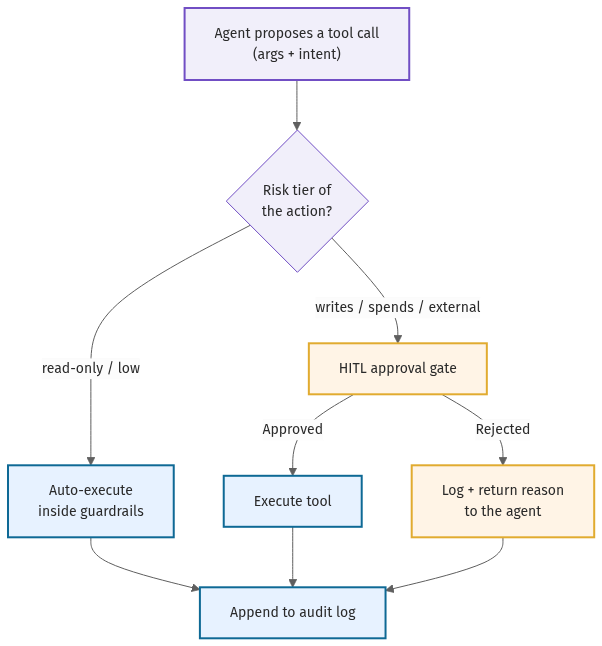

# 04 · Tool design & contracts

Tools are where an agent stops being a chatbot and starts touching the world — and they are the most
common production failure point. Not the model, not the prompt: the tool layer. The model passes a
malformed argument and your billing API double-charges; a tool description carries an injected
instruction; a retry fires a non-idempotent write twice; an egress tool ships private data to an
attacker's endpoint. Every one of those is a *tool-design* bug, fixable before the side effect, not
after. This chapter is the discipline that closes those gaps. Its companion artifact is the
[tool contract template](../templates/tool-contract-template.md) — one per tool, filled before the tool
is ever exposed.

The governing principle: **the model's freedom ends where your guardrails begin.** The model is allowed
to be wrong about *which* tool to call and *what* arguments to pass. Your job is to make those errors
cheap — caught at the boundary, never executed.

## Schemas, validation, and the description as prompt

A tool definition is two things at once: a typed contract your code enforces, and a piece of prompt the
model reads to decide when to call it. Treat both as load-bearing.

- **Name and describe for the model.** The name the model sees is part of the prompt — call it
  `refund_order`, not `call_billing_v2`. The description should state precisely *when to call and when
  NOT to call*, because overlapping tools are a leading cause of misfires. The
  [12-factor agents](../references.md#12-factor-agents) playbook and
  [OpenAI's practical guide](../references.md#openai-practical-guide-agents) both treat tool surfaces as
  first-class design, not an afterthought.
- **Validate at the boundary, not in the prompt.** The model *will* pass out-of-range and malformed
  values; no amount of "please only pass valid amounts" prevents it. Enforce types, ranges, enums, and
  max-lengths in code and reject before the side effect. A rejection is a clean signal the agent can
  re-plan on; a bad write is a correctness incident.
- **Cap output size.** A tool that returns a 50,000-row dump blows the context window and the bill.
  Paginate or summarize at the boundary.
- **Keep the surface small.** Fewer, sharper tools beat a sprawling API surface — every extra tool is
  another thing the model can confuse, and another row in your [threat model](11-security-and-threat-model.md).

## Side effects: idempotency, retries, and timeouts

Classify every tool by blast radius — read-only, writes-data, spends-money, sends-message,
external-irreversible — because the controls scale with that classification. A read-only tool is cheap
to get wrong. A tool that sends, spends, or deletes is not.

- **Idempotency keys on every side-effecting tool.** If `refund_order` is not idempotent, a retry is a
  *correctness bug*, not a convenience — it refunds twice. Pass a stable idempotency key (derived from
  the task and intent, not a timestamp) so the backing system dedupes the retry. This is the single most
  overlooked control in agent tool design.
- **Retries with backoff — and a retry policy per error.** A `rate_limited` warrants one backed-off
  retry; an `upstream_5xx` retries then escalates; an `invalid_input` or `forbidden` must **never**
  retry — retrying a permission error just hammers a wall. Encode the per-error response in the contract.
- **Timeouts, always.** A tool call with no timeout is a hung agent. Set a wall-clock bound and treat
  the timeout as a normal, handled error mode.
- **Never let the agent fake success.** A `not_found` is an answer, not a cue to hallucinate a result.
  Surface tool errors to the model honestly; papering over them produces confident, wrong runs.

## Permissions, allowlists, and capability scoping

Least privilege is the whole game. A tool scoped to `refunds:create` cannot be tricked into
`refunds:delete`.

- **Narrowest scope that works.** Grant the specific permission, not the role. The agent should act as
  its *own* identity or the *end user* (per-user, on-behalf-of) — never a shared admin token (see
  [chapter 10](10-agent-identity-and-auth.md) for identity, and `tool-contract-template.md` §8).
- **Egress allowlists, deny by default.** Any tool that can reach an external endpoint is an
  exfiltration path until proven otherwise. Allowlist outbound destinations and block the rest at the
  network layer.
- **Capability tier per tool.** Tag each tool with its L0–L4 tier (`capability-tier-ladder.md`). A
  spend-money tool does not belong on an L2-guardrails agent without a hard pre-execution cap.

## Approval gates and the lethal trifecta

Some actions are too consequential to run unattended. An **approval gate** pauses the loop and routes
the proposed call to a human, who approves or rejects before execution. The
[HumanLayer](../references.md#humanlayer) SDK is the canonical pattern for wiring this in; the
[human-in-the-loop policy](../templates/human-in-the-loop-policy.md) decides *which* actions need it.

The flow above is the spine of safe tool use: a side-effecting call is classified, low-risk calls run
auto, and consequential calls (spend, send, delete, external-irreversible) divert to human-approve
before they touch the world — and *every* decision, approved or rejected, is logged.

Approval gating is not optional once a tool surface hits the **lethal trifecta**. Simon Willison's
formulation is the clearest test:
[an agent that combines access to private data, exposure to untrusted content, and the ability to
communicate externally is a standing data-exfiltration path](../references.md#willison-lethal-trifecta).
A poisoned web page (untrusted content) instructs the agent to read a secret (private data) and POST it
to an attacker (external comms) — and the agent obliges, because injected instructions and legitimate
ones look identical. If a tool surface closes all three legs, you must **break one leg before
shipping**: drop the sensitive read scope, isolate the agent from untrusted input, or remove the egress
tool — or, where the action must remain available, gate the egress behind a human approval. The full
threat model, including the
[Meta "Rule of Two"](../references.md#meta-rule-of-two) corollary, lives in
[chapter 11](11-security-and-threat-model.md).

## Audit logs and observability

Every tool call emits one structured log line — tool name, redacted args, caller identity, the
approve/reject decision, latency, cost, and result status — correlated by the trace/span id that ties
it to the agent run. Redact PII, secrets, and tokens at the logging boundary. Alert on the signals that
mean trouble: repeated rejections, cost spikes, and scope-violation attempts (a `forbidden` is an
attacker probing your boundary). Treat *tool results as untrusted input* and log them as such — a result
that carries an injection is evidence, not just an error. Without this audit trail you cannot replay an
incident, prove an approval happened, or satisfy the record-keeping the EU AI Act expects of higher-risk
systems ([chapter 12](12-eu-ai-act-as-architecture.md)).

Fill a [tool contract](../templates/tool-contract-template.md) for each tool before exposure, and again
whenever it gains a write, a spend, or a new scope. The rejection example in that template — the call
your boundary refuses — is the row that proves the guardrail actually holds.
