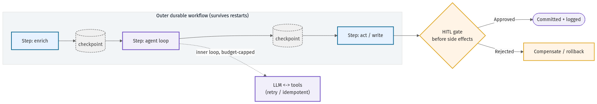

# 05 · Memory, state & durable execution

An agent that cannot remember is a goldfish with API keys; an agent that cannot resume is a liability
the moment a process dies mid-task. This chapter covers the two halves of agent state: **memory** (what
the agent knows, across a turn and across sessions) and **durable execution** (how a long-running agent
survives crashes, retries, and redeploys without re-charging a customer or looping forever). The
operational targets for both — how long a run may take, how much it may cost, when it must give up —
belong in an [agent SLO definition](../templates/agent-slo-definition.md).

## Memory: short-term, long-term, and the retrieval layer

**Short-term (working) memory** is the context window: the system prompt, the running message history,
tool results, and scratchpad reasoning for the *current* task. It is fast and coherent but bounded and
expensive — every token is paid for on every step. The core discipline is *context engineering*: keep
only what the next decision needs. Summarize or evict stale tool outputs, cap retrieved payloads at the
tool boundary ([chapter 04](04-tool-design-and-contracts.md)), and never let an unbounded
retrieve-and-append loop drown the signal. A bloated context is slower, costlier, and *less* accurate as
the model loses the thread among low-relevance chunks.

**Long-term memory** persists across sessions and comes in three flavours worth distinguishing:

- **Episodic** — a record of *what happened*: past runs, decisions, and their outcomes. Useful for
  "have I done this before?" and for post-hoc audit.
- **Semantic** — distilled *facts and preferences*: a user's account tier, a standing instruction, a
  learned constraint. Smaller and more durable than episodic logs.
- **Procedural** — *how to do things*: reusable skills and playbooks the agent loads on demand.

The storage substrate is usually a **vector store** for similarity retrieval over episodic and semantic
memory, often paired with a plain key-value or relational store for exact lookups. Two cautions. First,
retrieved memory is *input*, and input can be poisoned — a planted "memory" can carry a prompt injection
([chapter 11](11-security-and-threat-model.md)), so treat memory reads with the same suspicion as tool
results. Second, memory is not a dumping ground: write deliberately (what is worth remembering, and for
how long), or you accumulate stale, contradictory state that degrades every future run.

## Durable execution: the outer-workflow / inner-loop pattern

A real agent task can run for minutes to hours: many LLM calls, many tool calls, waits for human
approval. Processes crash, pods get rescheduled, deploys roll. If your agent loop lives only in process
memory, a crash at step 30 either loses everything or — worse — replays side effects and double-acts.

The industry has converged on a single pattern: **an outer durable workflow wrapping an inner LLM agent
loop, where every LLM call and tool call is journaled as a durable activity.** The orchestrator
(Temporal-style workflows, or LangGraph-style checkpointers, are the common implementations) persists
each step's input and result to a durable log. On a crash, the workflow *replays* from the journal:
already-completed activities return their recorded results instead of re-executing, and the agent
resumes exactly where it stopped. The non-deterministic, side-effecting work — the model call, the API
write — is pushed into activities; the orchestration logic stays deterministic and replayable.

As the diagram shows, the durable boundary is the key design decision: the *workflow* owns control flow
and the journal, while each *LLM call* and *side-effecting tool call* is an activity with a recorded
result. Replay re-derives the path from the journal; it does not re-run the model or re-charge the card.

This pattern also makes **human-in-the-loop** natural. An approval gate
([chapter 04](04-tool-design-and-contracts.md)) becomes a durable wait — the workflow suspends, costing
nothing, until a human responds hours later, then resumes. No held connection, no lost state.

## Defenses: budgets, loop detection, idempotency, circuit breakers

Durability keeps an agent *alive*; these four controls keep an alive agent from running *away*. A
runaway agent is the failure mode that turns into a five-figure bill or a flood of duplicate writes
overnight, so enforce all four — pre-execution, not as after-the-fact alerts.

- **Pre-execution budget enforcement.** Cap each task on three axes — USD, tokens, and steps — and check
  the cap *before* each LLM/tool call, not after the spend. A hard ceiling that aborts the run is the
  difference between a bounded loss and an unbounded one. These caps are the same numbers you commit to
  in the [agent SLO definition](../templates/agent-slo-definition.md).
- **Input-hash loop detection.** Hash each (action, arguments) pair; if the agent proposes a call it has
  already made with identical inputs N times, it is stuck in a loop. Break it — escalate or abort —
  rather than letting it grind. This is the cheapest, highest-leverage anti-spin control.
- **Idempotency keys on side-effecting tools.** Durable replay re-invokes the workflow, and retries
  re-invoke tools. Both are safe *only* if every write carries an idempotency key the backing system
  dedupes on. Without it, "exactly once" silently becomes "at least once" and the agent double-charges
  on replay. (This is the same control from [chapter 04](04-tool-design-and-contracts.md) — durable
  execution is precisely the context that makes it non-optional.)
- **Circuit breakers.** When a downstream tool starts failing, an agent will dutifully retry it into the
  ground. Trip a breaker after a failure threshold: stop calling the failing dependency, fail fast, and
  surface the degraded state instead of burning budget on a dead endpoint.

Together these turn an agent from "runs until something stops it" into "runs within explicit, enforced
limits and resumes cleanly when interrupted." Memory gives the agent continuity of *knowledge*; durable
execution gives it continuity of *work*; the four defenses keep that continuity from becoming a runaway.
Wire the limits into the spec and the SLO before the agent serves real traffic — see the
[agent SLO definition](../templates/agent-slo-definition.md) for the numbers you must commit to and
alert on.
