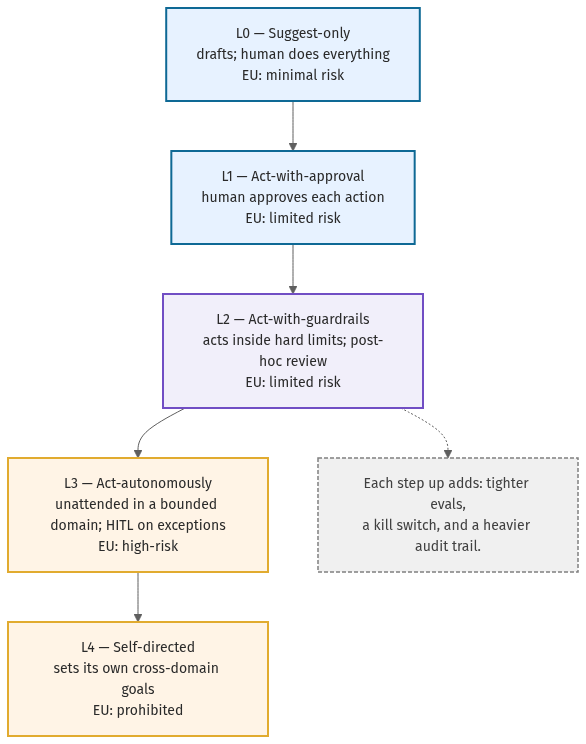

# 12 · EU AI Act as architecture

This is the chapter US-centric playbooks skip. The [EU AI Act](../references.md#eu-ai-act) is usually
read as a compliance burden — a thing legal does after engineering ships. That framing is a mistake.
Articles 11, 12, and 14 describe **architecture**: technical documentation, traceability, and human
oversight that you either build into the system or bolt on expensively later. Build them in.

## The three articles as components

- **Article 11 — Technical documentation.** The system's purpose, design, capabilities, and limits,
  kept current. Architecturally, this is a living [agent design spec](../templates/agent-design-spec.md)
  plus the [capability-tier ladder](../templates/capability-tier-ladder.md) entry — generated from the
  system, not written about it after the fact.
- **Article 12 — Record-keeping / traceability.** Automatic logging across the system's lifetime.
  Architecturally, this is an **immutable audit log** and lifecycle traces
  ([chapter 14](14-observability-lite.md)) — every decision, tool call, and approval reconstructable
  from the [observability event schema](../templates/observability-event-schema.json).
- **Article 14 — Human oversight.** A human can understand, intervene, and stop the system.
  Architecturally, this is the [HITL policy](../templates/human-in-the-loop-policy.md) and a kill
  switch wired into the loop, not a person told to "keep an eye on it."

## Capability tier ↔ risk class

The Act classifies AI systems by **use case and context**, not autonomy alone, into risk classes:
**minimal**, **limited**, **high-risk**, and **prohibited** (unacceptable). This handbook maps each
rung of the capability-tier ladder to the risk class it floors at — the same mapping that is canonical
in `repo.config.json`, the [ladder template](../templates/capability-tier-ladder.md), and the
`09-capability-tier-ladder` diagram:

| Tier | Name | Criteria | EU AI Act risk class |
|------|------|----------|----------------------|
| L0 | Suggest-only | Drafts and suggestions; a human takes every consequential action. | minimal |
| L1 | Act-with-approval | Agent proposes actions; a human approves each before execution. | limited |
| L2 | Act-with-guardrails | Agent acts inside hard, pre-execution policy limits; humans review after the fact. | limited |
| L3 | Act-autonomously | Agent acts unattended within a bounded domain; HITL only on flagged exceptions. | high-risk |
| L4 | Self-directed | Agent sets and revises its own goals across domains without scoped human oversight. | prohibited |

The risk class is the **floor**, not the ceiling: a low-autonomy agent in an Annex III domain
(employment, credit, essential services, law enforcement, medical) is high-risk regardless of tier.
Read the tier as "this is at least this risky"; let the domain raise it.

> This mapping is an **architectural** aid, not legal advice. Confirm classification against current
> EU AI Act guidance for your specific use case — _as of June 2026 — verify before relying_.

## What this buys you

Designing to Articles 11/12/14 from day one means an agent that is auditable, stoppable, and
documented — which is exactly what the [production-readiness checklist](../templates/production-readiness-checklist.md)
demands and what a board wants to see before sign-off. The EU lens is not overhead; it is the same
discipline that makes the [security](11-security-and-threat-model.md) and
[evaluation](13-evaluations.md) surfaces trustworthy, written down in a form a regulator recognizes.
The healthcare [example 05](../examples/README.md) shows Articles 11/12/14 wired into a running agent.
