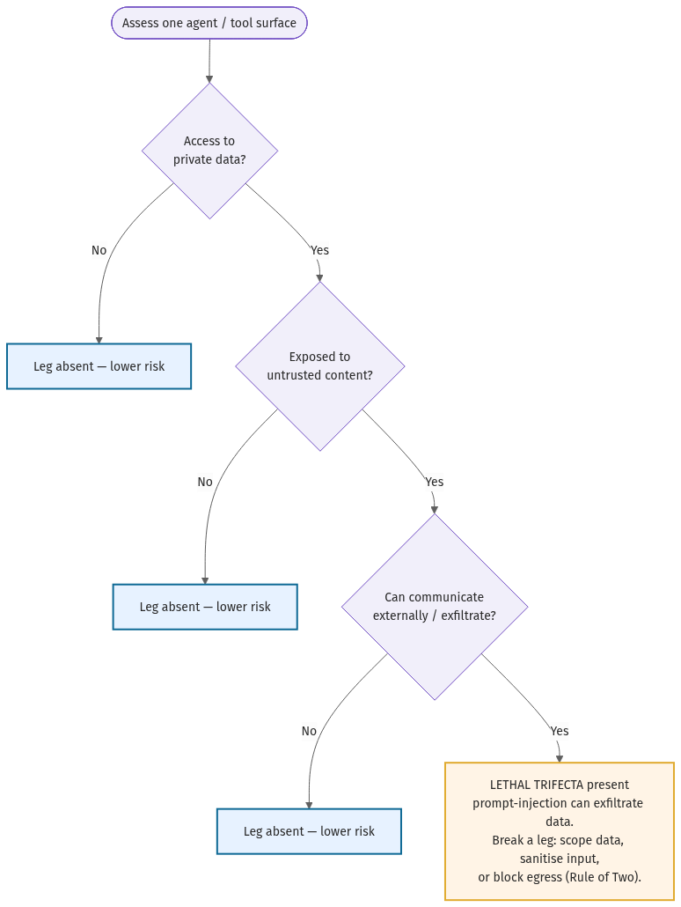
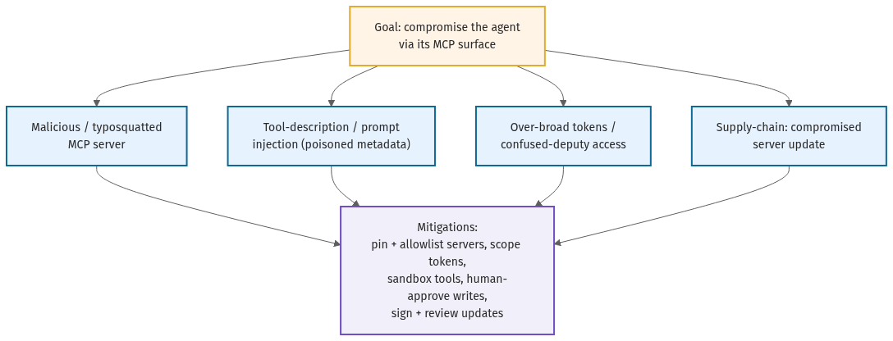

# Prompt-Injection Threat Model

**Purpose:** Enumerate how an attacker can turn your agent's own inputs into instructions, and force a
decision on each exposure before launch. Prompt injection is not a bug you patch once — it is a
standing property of any agent that reads text it did not write.
**When to use:** Before launch, when adding a tool or data source, and whenever the agent gains access
to new untrusted content. Pairs with [`mcp-server-governance.md`](mcp-server-governance.md) and the
[`production-readiness-checklist.md`](production-readiness-checklist.md).
**How to fill:** Copy this file, complete every table for your agent, and decide a control for each
exposure. Replace `{{PLACEHOLDER}}`s; delete the _italic guidance_.

---

## 1. The three exposures (enumerate all three)

Every agent that consumes text faces these. Mark which apply.

| Exposure | What it is | Applies? | Example for this agent |
|----------|-----------|----------|------------------------|
| **Direct** | A user types injection into the prompt the agent reads (jailbreak, instruction override). | {{yes/no}} | {{}} |
| **Indirect** | Untrusted content the agent retrieves carries hidden instructions (a web page, email, doc, tool output, MCP resource). | {{yes/no}} | {{}} |
| **Lethal trifecta** | The agent has, on one surface, **(a) access to private data, (b) exposure to untrusted content, and (c) the ability to communicate externally** — so an injection can exfiltrate. | {{yes/no}} | {{}} |

## 2. Lethal-trifecta self-assessment

_Answer per tool/surface. If all three legs are present on one path, an indirect injection can read
private data and send it out. Break at least one leg._

| Surface / tool | (a) Private data access | (b) Untrusted input | (c) External egress | Trifecta? | Leg you break |
|----------------|------------------------|---------------------|---------------------|-----------|---------------|
| {{tool}} | {{yes/no}} | {{yes/no}} | {{yes/no}} | {{yes/no}} | {{scope data / sanitize input / block egress}} |

## 3. Attack tree

_Walk the tree for your agent. For each branch, record whether it is reachable and the control._

| Attack path | Reachable here? | Control |
|-------------|-----------------|---------|
| Malicious / typosquatted tool or MCP server | {{}} | {{pin + allowlist servers}} |
| Poisoned tool description / metadata injection | {{}} | {{review tool descriptions; treat as untrusted}} |
| Indirect injection via retrieved content | {{}} | {{isolate + label untrusted content; constrain actions}} |
| Over-broad token / confused deputy | {{}} | {{least-privilege scoped tokens}} |
| Exfiltration via an external-comms tool | {{}} | {{egress allowlist; human-approve sends}} |
| Supply-chain: compromised server/model update | {{}} | {{sign + review updates; no auto-update}} |

## 4. Rule of Two

_A practical guardrail: of the three powers — **act on untrusted input**, **access private data/systems**,
**change state or communicate externally** — let the agent hold at most **two** without a human in the
loop. Record which two, and how the third is gated._

- Powers held autonomously: {{two of: untrusted-input / private-data / external-change}}
- The third power is gated by: {{human approval / removed / sandboxed}}

## 5. Controls summary & residual risk

| Exposure | Primary control | Residual risk | Owner |
|----------|-----------------|---------------|-------|
| Direct | {{input handling, system-prompt hardening, output checks}} | {{}} | {{}} |
| Indirect | {{untrusted-content isolation, constrained tool use}} | {{}} | {{}} |
| Lethal trifecta | {{leg broken + how}} | {{}} | {{}} |

## 6. Named incidents to learn from

_Real, documented agent-security failures this model defends against. Each is labeled — verify before
relying. See chapter 11 for sources._

- {{e.g. an agent deleting a production database on an unsanctioned action}} — _illustrative; see ch11, verify._
- {{e.g. data-exfiltration via indirect injection in a connected assistant}} — _illustrative; see ch11, verify._

> **_As of {{month year}} — verify all incident references and CVEs against primary sources before relying._**
